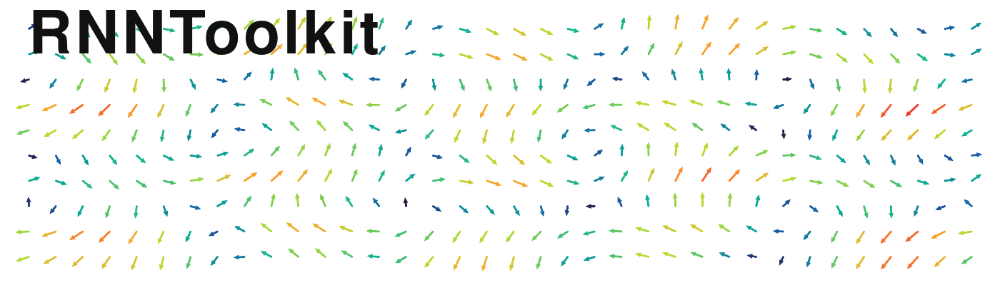

[](https://rnntoolkit.readthedocs.io/en/latest/)

RNNToolkit provides small, focused utilities for analyzing recurrent neural networks (RNNs) in PyTorch. It includes tools for local linearization, fixed point discovery, and flow-field visualization. Great for neuroscience modeling with RNNs! :brain:

## What is included :bar_chart:

- Linearization helpers to compute Jacobians and eigendecompositions around a state.
- Fixed point finding utilities with filtering, saving, and analysis helpers.
- Flow field construction in a reduced 2D subspace (PCA).

## Requirements

- Python 3.10+
- torch
- numpy
- scikit-learn (for flow field PCA)

## Install / use locally :computer:

Install from source in the project root directory using:

```bash
pip install -e .
```

## Package layout
| Component | Description |
| --- | --- |
| `rnntoolkit.fixed_points` | Module to run fixed point optimization on RNNs    |
| `rnntoolkit.flow_fields`  | Compute flow fields / phase portraits on RNN states in reduced dimensions |
| `rnntoolkit.linear`       | Linearize RNNs about states and compute jacobians |

## Quick start :zap:

### Linearization :microscope:

`Linearization` expects an RNN-like module.

```python
import torch
from rnntoolkit.linear.linearization import Linearization

rnn = torch.nn.RNN(input_size=2, hidden_size=2, nonlinearity="tanh", batch_first=True)

lin = Linearization(rnn)
state = torch.tensor([0.1, -0.2])
J_rec, J_inp = lin.jacobian(state)
```

### Fixed point finder :compass:

`FixedPointFinder` works with standard PyTorch RNN/GRU/LSTM modules.

```python
import torch
from rnntoolkit.fixed_points.fp_finder import FixedPointFinder

rnn = torch.nn.RNN(input_size=2, hidden_size=2, nonlinearity="tanh", batch_first=True)
fp_finder = FixedPointFinder(rnn, max_iters=100, verbose=False, super_verbose=False)

initial_states = torch.tensor([[0.1, -0.1], [0.2, 0.0]])
ext_inputs = torch.tensor([0.0, 0.0])
unique_fps, all_fps = fp_finder.find_fixed_points(initial_states, ext_inputs)
print(unique_fps.n)
```

### Flow fields :cyclone:

`FlowFieldFinder` also works with standard PyTorch RNNs.

```python
import torch
from rnntoolkit.flow_fields.flow_field_finder import FlowFieldFinder

rnn = RNN(input_size=2, hidden_size=2, nonlinearity="tanh", batch_first=True)
flow_finder = FlowFieldFinder(rnn, num_points=25, x_offset=1, y_offset=1)

states = torch.randn(10, 2)
inputs = torch.zeros(10, 2)
flows = flow_finder.find_nonlinear_flow(states, inputs)
print(len(flows))
```
